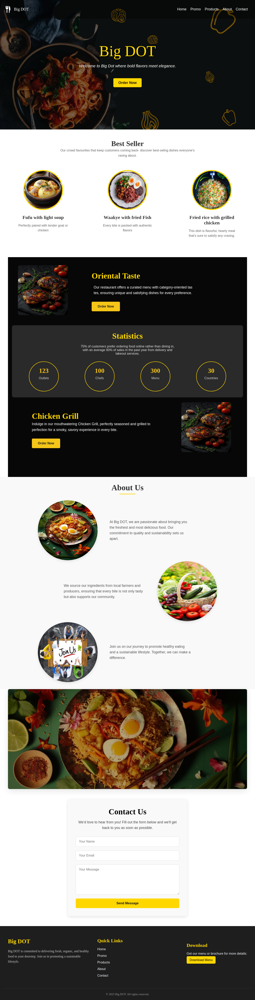
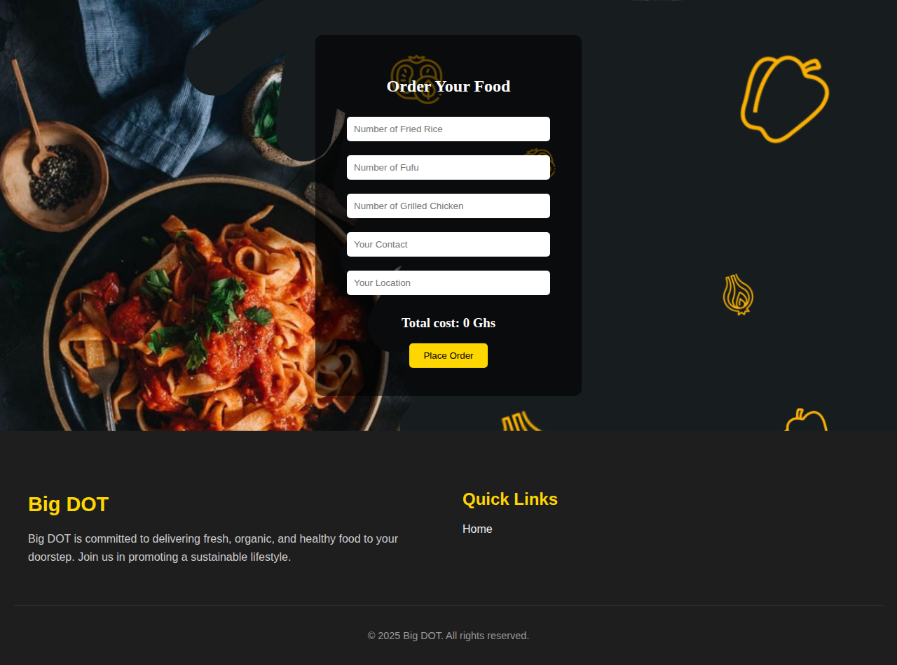

# 🍽️ Big DOT Restaurant Website

> A modern, responsive restaurant website showcasing authentic African cuisine and providing seamless online ordering experience.



## 🌟 Overview

**Big DOT** is a comprehensive restaurant website developed as part of an internship program. This project demonstrates modern web development practices while creating an engaging digital presence for a restaurant specializing in authentic African cuisine. The website features a beautiful, responsive design that works seamlessly across all devices.

### 🎯 Project Goals
- Create an immersive dining experience through digital storytelling
- Provide easy online ordering functionality
- Showcase menu items with appealing visuals
- Ensure accessibility across all devices and screen sizes
- Demonstrate professional web development skills

## ✨ Features

### 🍽️ Restaurant Features
- **Interactive Menu Display** - Beautifully presented dishes with descriptions and pricing
- **Online Ordering System** - Complete food ordering with quantity selection and cost calculation
- **Restaurant Information** - About us section highlighting quality and sustainability
- **Contact Form** - Direct communication channel for customer inquiries
- **Statistics Dashboard** - Business metrics and achievements

### 💻 Technical Features
- **Fully Responsive Design** - Optimized for desktop, tablet, and mobile devices
- **Smooth Scroll Navigation** - Enhanced user experience with animated scrolling
- **Mobile-First Approach** - Progressive enhancement from mobile to desktop
- **Interactive Hamburger Menu** - Collapsible navigation for mobile devices
- **CSS Animations** - Engaging hover effects and scroll-triggered animations
- **Form Validation** - Client-side validation for order and contact forms
- **Modern CSS Grid & Flexbox** - Contemporary layout techniques
- **Cross-Browser Compatibility** - Works across all modern browsers

## 🛠️ Technologies Used

| Technology | Usage | Percentage |
|------------|--------|------------|
|  | Structure & Content | 43.6% |
|  | Styling & Layout | 47.2% |
|  | Interactivity & Logic | 9.2% |

### Additional Technologies
- **Google Fonts** - Dancing Script for elegant typography
- **CSS Custom Properties** - For maintainable color schemes
- **CSS Grid & Flexbox** - Modern layout systems
- **Vanilla JavaScript** - No framework dependencies

## 🚀 Quick Start

### Prerequisites
- A modern web browser (Chrome, Firefox, Safari, Edge)
- Basic understanding of HTML/CSS/JavaScript (for development)

### Installation & Setup

1. **Clone the repository**
   ```bash
   git clone https://github.com/McAnnison/revolve-web.git
   cd revolve-web
   ```

2. **Launch the website**
   
   **Option A: Direct file opening**
   ```bash
   # Simply open index.html in your browser
   open index.html  # macOS
   start index.html # Windows
   xdg-open index.html # Linux
   ```
   
   **Option B: Local server (recommended)**
   ```bash
   # Using Python
   python -m http.server 8000
   # Or using Python 3
   python3 -m http.server 8000
   
   # Using Node.js (if you have it installed)
   npx serve .
   
   # Using PHP
   php -S localhost:8000
   ```

3. **Open in browser**
   ```
   http://localhost:8000
   ```

## 📁 Project Structure

```
revolve-web/
├── 📄 index.html          # Main homepage
├── 📄 order.html          # Online ordering page
├── 🎨 style.css           # Main stylesheet
├── ⚡ script.js           # JavaScript functionality
├── 📁 assets/             # Media and documents
│   ├── 🖼️ logo1.png        # Restaurant logo
│   ├── 🖼️ back2.png        # Header background
│   ├── 🖼️ chicken.jpeg     # Food images
│   ├── 🖼️ fufu.png         # Menu item images
│   ├── 🖼️ farm.jpeg       # About us images
│   ├── 📄 aboutBig.pdf     # Downloadable menu
│   └── 📸 screenshot-*.png # Documentation images
└── 📖 README.md           # Project documentation
```

## 📱 Page Overview

### 🏠 Homepage (`index.html`)


**Sections included:**
- **Hero Section** - Welcome message with call-to-action
- **Best Sellers** - Featured menu items with images
- **Oriental Taste Promo** - Special offers section
- **Statistics** - Business achievements and numbers
- **Chicken Grill Feature** - Highlighted dish presentation
- **About Us** - Company story and values
- **Contact Form** - Customer inquiry form
- **Footer** - Quick links and downloadable menu

### 🛒 Order Page (`order.html`)


**Features:**
- Dynamic quantity selection for menu items
- Real-time price calculation
- Contact and location input fields
- Responsive form design
- Order submission functionality

## 🎨 Design Highlights

### Color Scheme
- **Primary Gold**: `#FFD700` - Elegant and luxurious
- **Dark Background**: `#1e1e1f` - Professional and sophisticated
- **Text Colors**: Various shades for optimal readability

### Typography
- **Primary Font**: Dancing Script - Elegant script for headings
- **Secondary Font**: Poppins - Clean sans-serif for body text

### Visual Elements
- Circular product images with gold borders
- Smooth hover animations and transitions
- Professional food photography
- Consistent spacing and alignment

## 🌐 Browser Compatibility

| Browser | Version | Status |
|---------|---------|--------|
| Chrome | 80+ | ✅ Fully Supported |
| Firefox | 75+ | ✅ Fully Supported |
| Safari | 13+ | ✅ Fully Supported |
| Edge | 80+ | ✅ Fully Supported |
| Opera | 67+ | ✅ Fully Supported |

## 📱 Responsive Breakpoints

- **Mobile**: 320px - 767px
- **Tablet**: 768px - 1023px
- **Desktop**: 1024px and above

## 🔧 Development

### Local Development Setup
```bash
# Clone and navigate to project
git clone https://github.com/McAnnison/revolve-web.git
cd revolve-web

# Start development server
python3 -m http.server 8000

# Open in browser
open http://localhost:8000
```

### Code Structure
- **HTML**: Semantic markup with accessibility considerations
- **CSS**: Mobile-first responsive design with CSS Grid and Flexbox
- **JavaScript**: Vanilla JS with ES6+ features, no external dependencies

## 🤝 Contributing

We welcome contributions! Here's how you can help:

1. **Fork the repository**
2. **Create a feature branch**
   ```bash
   git checkout -b feature/amazing-feature
   ```
3. **Make your changes**
4. **Commit your changes**
   ```bash
   git commit -m 'Add some amazing feature'
   ```
5. **Push to the branch**
   ```bash
   git push origin feature/amazing-feature
   ```
6. **Open a Pull Request**

### Contribution Guidelines
- Follow existing code style and conventions
- Test your changes across different browsers
- Update documentation if necessary
- Ensure responsive design is maintained

## 📞 Contact & Support

- **Project Maintainer**: McAnnison
- **Repository**: [revolve-web](https://github.com/McAnnison/revolve-web)
- **Issues**: [Report bugs or request features](https://github.com/McAnnison/revolve-web/issues)

## 📄 License

This project is developed for **educational purposes** as part of an internship program. 

### Usage Rights
- ✅ Educational use
- ✅ Portfolio inclusion
- ✅ Learning and reference
- ❌ Commercial use without permission

---

<div align="center">

**Built with ❤️ for Big DOT Restaurant**


*Where bold flavors meet elegant design* 🍽️

</div>